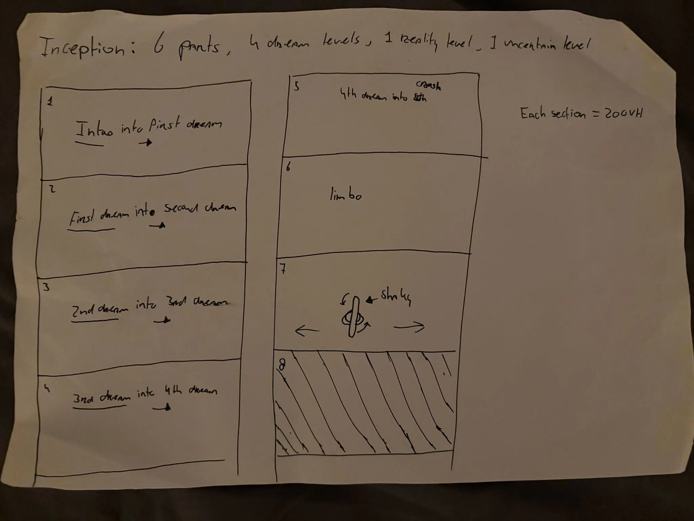
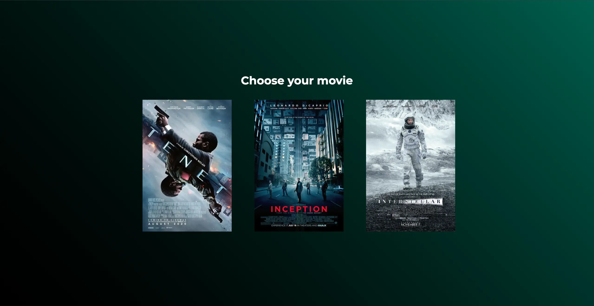

# CSS To The Rescue

## Inhoudsopgave

- [Week 1](#week-1)
  - [Maandag 24 Feb](#maandag-24-feb)
  - [Dinsdag 25 Feb](#dinsdag-25-feb)
  - [Vrijdag 28 Feb](#vrijdag-28-feb)
- [Week 2](#week-2)
  - [Maandag 3 Mar](#maandag-3-mar)
  - [Dinsdag 4 Mar](#dinsdag-4-mar)
  - [Vrijdag 7 Mar](#vrijdag-7-mar)
- [Week 3](#week-3)
  - [Maandag 10 Mar](#maandag-10-mar)
  - [Dinsdag 11 Mar](#dinsdag-11-mar)
  - [Vrijdag 14 Mar](#vrijdag-14-mar)
- [Week 4](#week-4)
  - [Maandag 17 Mar](#maandag-17-mar)
  - [Dinsdag 18 Mar](#dinsdag-18-mar)
  - [Vrijdag 21 Mar](#vrijdag-21-mar)

## Week 1

### Maandag 24 Feb

We begonnen met een css to the rescue introductie opdracht. Hiervoor werden er verschillende groepen gemaakt binnen de klas en elk van deze groepen had een thema waarvoor testjes gemaakt moesten worden. Het thema die mijn groep had was: Makeup. IK had hiervoor een test gemaakt met blend mode en de nieuwe kleuren die beschikbaar zijn in css.

Hieruit heb ik een aantal nieuwe dingen geleerd, vooral over kleuren waar ik van Sanne een uitgebreide uitleg van heb gekregen. Als we bijvoorbeeld kijken naar oklch, zou deze in theorie een betere kleur op moeten leveren dan bij gebruik van hsl. Het nadeel is alleen dat het kleurbereik van oklch groter is dan die van de monitoren die er bestaan wat er voor zorgt dat een lijn wordt getrokken van het punt in oklch naar het punt op de huidige ondersteunde kleuren, wat ervoor kan zorgen dat een kleur er misschien anders uitziet dan bedoeld of zelfs dat de kleur per monitor verschilt. Bij het gebruik van gradients is oklch wel een stuk mooier dan hsl aangezien de intensiteit tussen kleuren gelijk wordt gemaakt, wat zorgt voor een mooie overloop.

Let op bij het gebruiken van oklch of een van de andere nieuwe kleuren dat je een hsl versie hebt en in een @supports de oklch kleuren zet, zodat browsers die geen support hebben voor oklch nog steeds een kleur hebben om weer te geven.

### Dinsdag 25 Feb

We begonnen met het presenteren van de testjes die we hadden gemaakt. Ik merkte meteen dat ik nieuwe kennis op gedaan had toen ik een vraag kreeg over hoe oklch eigenlijk werkt en ik dat meteen kon uitleggen. Na de presentaties kregen we uitleg over de eindopdracht van CSS To The Rescue. We hadden keuze uit 3 verschillende opdrachten en ik heb gekozen voor een film tijdlijn. De film die ik kies is: Inception. Ik heb deze film gekozen, omdat er veel diepte zit in de film en er veel verschillende lagen (Droomlagen) zijn. Dit geeft ruimte voor gecompliceerde functionaliteiten waarmee ik kan experimenteren. Ik heb de rest van de les besteed aan het bedenken van een concept en heb alvast deze schets gemaakt:

### Vrijdag 28 Feb

Tijdens deze eerste feedback ronde zaten we in een groepje met Sanne en deelde we onze concepten en als we al iets hadden gemaakt deelde we dat ook. Hierbij kregen we tips en tops van elkaar waaruit wel wat handige tips kwamen. Voor volgende week weet ik dat ik moet beginnen met het uitwerken van mijn concept om die zo iets duidelijker te maken. Ik ben wel blij dat ik een aantal vragen heb kunnen stellen aan Sanne over mogelijkheden met CSS, dus daar kan ik ook mee experimenteren aankomende week!

## Week 2

### Maandag 3 Mar

Ik begon deze week met het uitbreiden van mijn concept. Ik heb als idee een movie picker erbij. Deze bestaat uit 3 films en van de geselecteerde film is er een timeline te zien. Ik heb vandaag de movie picker ook kunnen laten werken en ga morgen verder met het maken van de timelines. Ook heb ik een workshop gevolgd van Roel Nieskens over glitch effecten. Hierbij maakten wij in een codepen glitch effecten zonder HTML.

### Dinsdag 4 Mar

### Vrijdag 7 Mar

## Week 3

### Maandag 10 Mar

### Dinsdag 11 Mar

### Vrijdag 14 Mar

## Week 4

### Maandag 17 Mar

### Dinsdag 18 Mar

### Vrijdag 21 Mar
