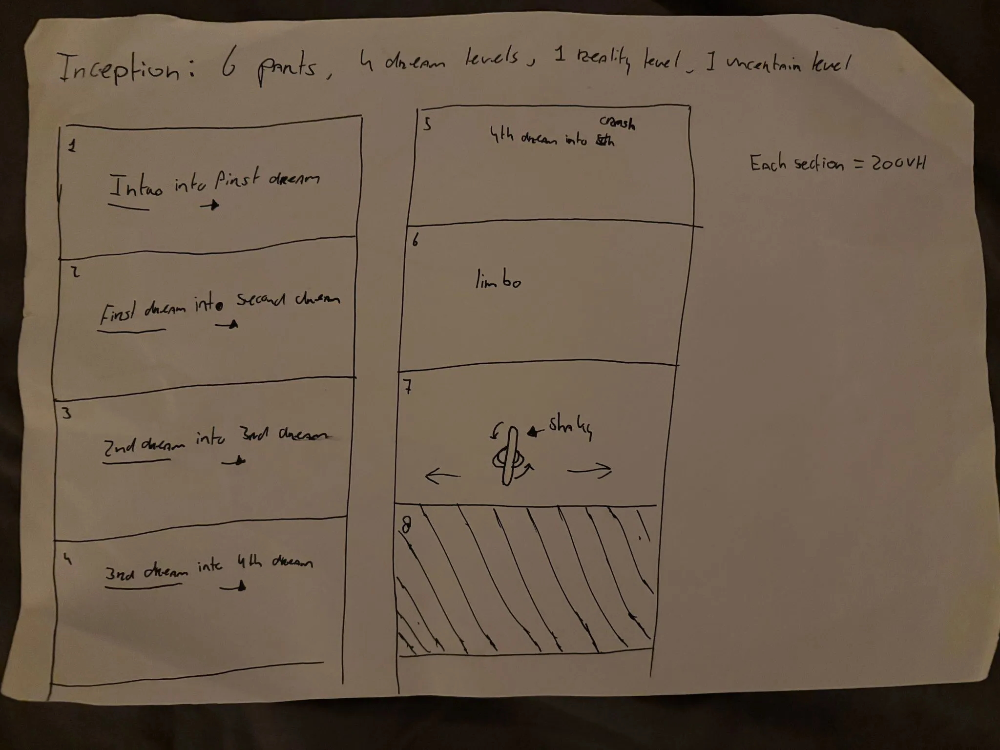
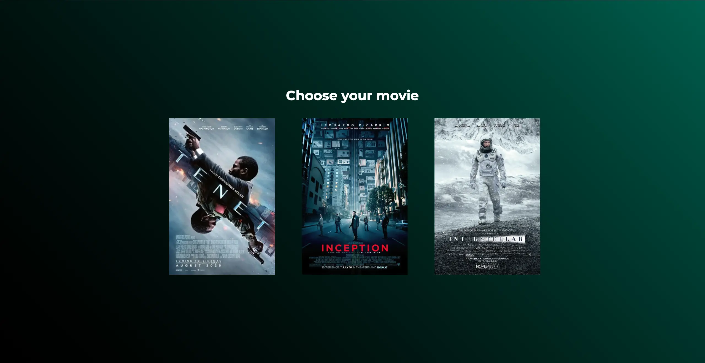
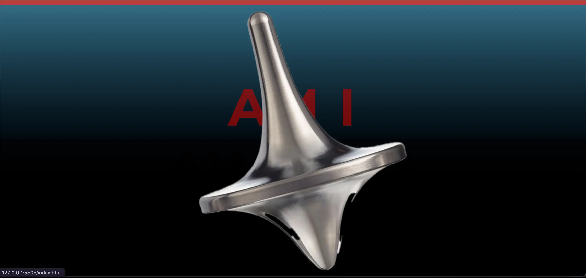
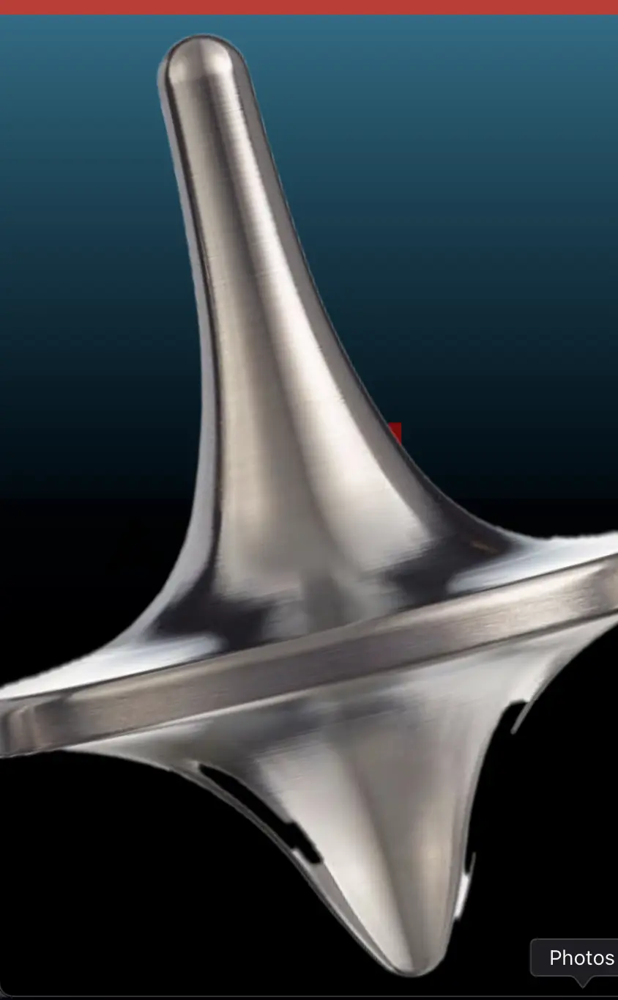
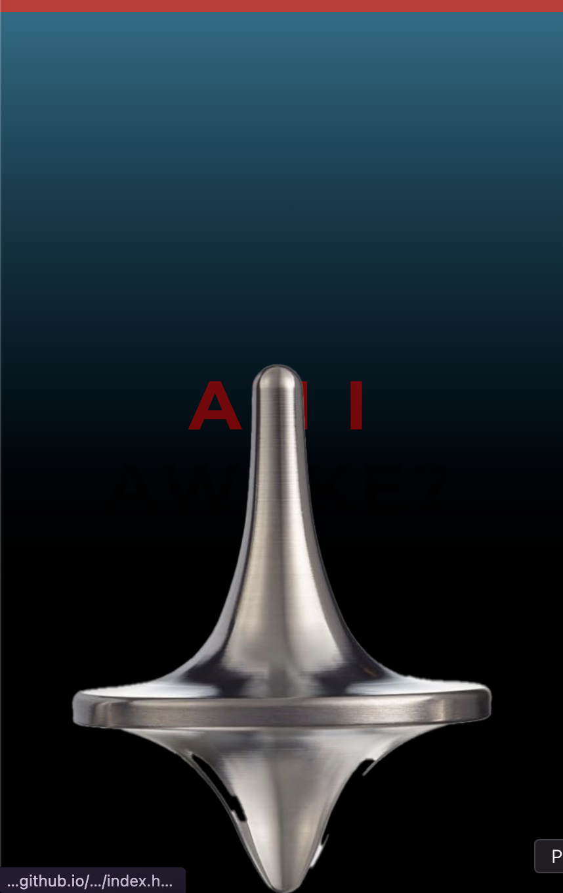
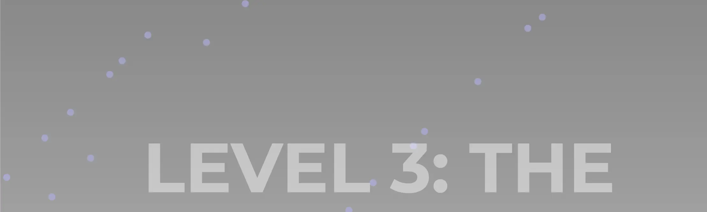
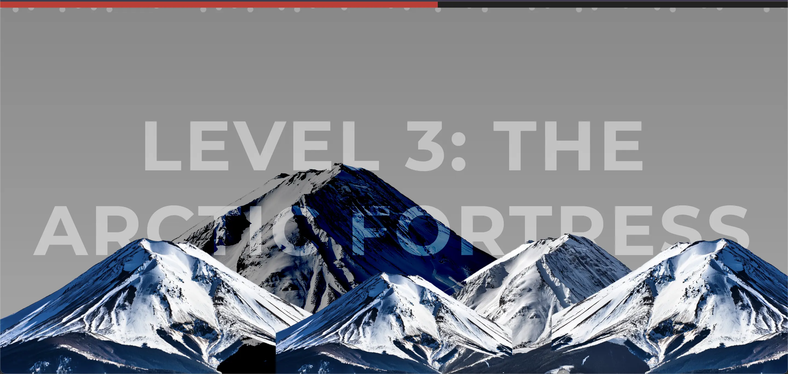
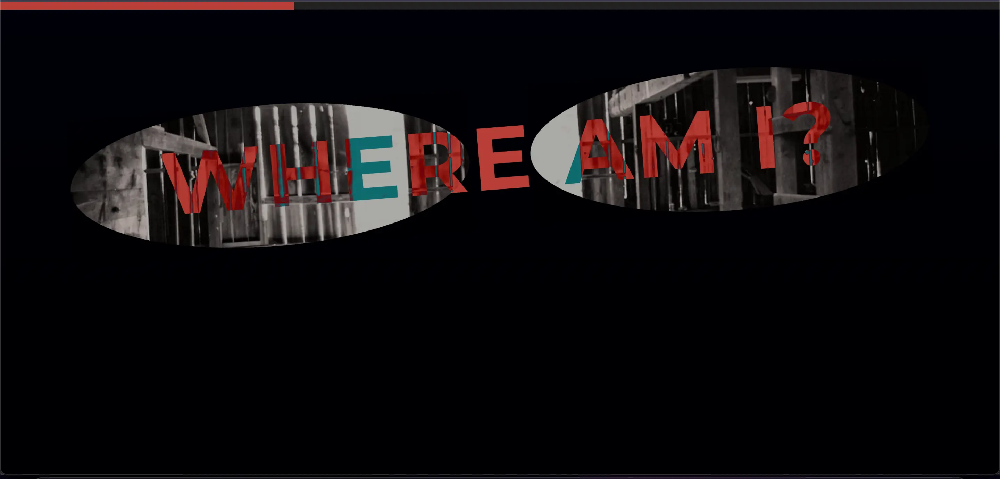
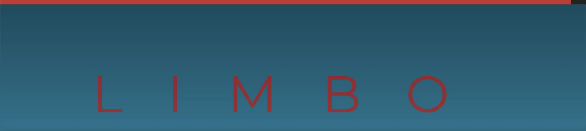

# CSS To The Rescue

## Inhoudsopgave

- [Concept](#concept)
- [Week 1](#week-1)
  - [Maandag 24 Feb](#maandag-24-feb)
  - [Dinsdag 25 Feb](#dinsdag-25-feb)
  - [Vrijdag 28 Feb](#vrijdag-28-feb)
- [Week 2](#week-2)
  - [Maandag 3 Mar](#maandag-3-mar)
  - [Dinsdag 4 Mar](#dinsdag-4-mar)
  - [Vrijdag 7 Mar](#vrijdag-7-mar)
- [Week 3](#week-3)
  - [Maandag 10 Mar](#maandag-10-mar)
  - [Dinsdag 11 Mar](#dinsdag-11-mar)
  - [Vrijdag 14 Mar](#vrijdag-14-mar)
- [Week 4](#week-4)
  - [Maandag 17 Mar](#maandag-17-mar)
  - [Dinsdag 18 Mar](#dinsdag-18-mar)
  - [Vrijdag 21 Mar](#vrijdag-21-mar)

## Concept

Mijn concept aan het begin van dit project was om een movie picker te maken waarbij meerdere films gekozen konden worden die dan gecombineerd werden tot een unieke storyline. Helaas werd ik toen ziek en kon ik niet werken aan het project dus besloot ik om de opdracht nog wel een movie picker te maken, maar dan met de originele storylines. Helaas was ik voor een langere tijd ziek dus heb ik uiteindelijk besloten om nog steeds de movie picker te maken, maar alleen 1 film uit te werken. Mijn concept uiteindelijk is dus een movie picker met inception als uitgewerkte storyline.

## Week 1

### Maandag 24 Feb

We begonnen met een css to the rescue introductie opdracht. Hiervoor werden er verschillende groepen gemaakt binnen de klas en elk van deze groepen had een thema waarvoor testjes gemaakt moesten worden. Het thema die mijn groep had was: Makeup. IK had hiervoor een test gemaakt met blend mode en de nieuwe kleuren die beschikbaar zijn in css.

Hieruit heb ik een aantal nieuwe dingen geleerd, vooral over kleuren waar ik van Sanne een uitgebreide uitleg van heb gekregen. Als we bijvoorbeeld kijken naar oklch, zou deze in theorie een betere kleur op moeten leveren dan bij gebruik van hsl. Het nadeel is alleen dat het kleurbereik van oklch groter is dan die van de monitoren die er bestaan wat er voor zorgt dat een lijn wordt getrokken van het punt in oklch naar het punt op de huidige ondersteunde kleuren, wat ervoor kan zorgen dat een kleur er misschien anders uitziet dan bedoeld of zelfs dat de kleur per monitor verschilt. Bij het gebruik van gradients is oklch wel een stuk mooier dan hsl aangezien de intensiteit tussen kleuren gelijk wordt gemaakt, wat zorgt voor een mooie overloop.

Let op bij het gebruiken van oklch of een van de andere nieuwe kleuren dat je een hsl versie hebt en in een @supports de oklch kleuren zet, zodat browsers die geen support hebben voor oklch nog steeds een kleur hebben om weer te geven.

### Dinsdag 25 Feb

We begonnen met het presenteren van de testjes die we hadden gemaakt. Ik merkte meteen dat ik nieuwe kennis op gedaan had toen ik een vraag kreeg over hoe oklch eigenlijk werkt en ik dat meteen kon uitleggen. Na de presentaties kregen we uitleg over de eindopdracht van CSS To The Rescue. We hadden keuze uit 3 verschillende opdrachten en ik heb gekozen voor een film tijdlijn. De film die ik kies is: Inception. Ik heb deze film gekozen, omdat er veel diepte zit in de film en er veel verschillende lagen (Droomlagen) zijn. Dit geeft ruimte voor gecompliceerde functionaliteiten waarmee ik kan experimenteren. Ik heb de rest van de les besteed aan het bedenken van een concept en heb alvast deze schets gemaakt:

### Vrijdag 28 Feb

Tijdens deze eerste feedback ronde zaten we in een groepje met Sanne en deelde we onze concepten en als we al iets hadden gemaakt deelde we dat ook. Hierbij kregen we tips en tops van elkaar waaruit wel wat handige tips kwamen. Voor volgende week weet ik dat ik moet beginnen met het uitwerken van mijn concept om die zo iets duidelijker te maken. Ik ben wel blij dat ik een aantal vragen heb kunnen stellen aan Sanne over mogelijkheden met CSS, dus daar kan ik ook mee experimenteren aankomende week!

## Week 2

### Maandag 3 Mar

Ik begon deze week met het uitbreiden van mijn concept. Ik heb als idee een movie picker erbij. Deze bestaat uit 3 films en van de geselecteerde film is er een timeline te zien. Ik heb vandaag de movie picker ook kunnen laten werken en ga morgen verder met het maken van de timelines. Ook heb ik een workshop gevolgd van Roel Nieskens over glitch effecten. Hierbij maakten wij in een codepen glitch effecten zonder HTML.

### Dinsdag 4 Mar

Ik was helaas sinds dinsdag 4 Maart ziek geworden en heb geen werk kunnen doen.

### Vrijdag 7 Mar

Ik was helaas sinds dinsdag 4 Maart ziek geworden en heb geen werk kunnen doen.

## Week 3

### Maandag 10 Mar

Ik was helaas sinds dinsdag 4 Maart ziek geworden en heb geen werk kunnen doen.

### Dinsdag 11 Mar

Ik was helaas sinds dinsdag 4 Maart ziek geworden en heb geen werk kunnen doen.

### Vrijdag 14 Mar

Ik heb scroll snap toegevoegd aan de website en ik heb alvast een aantal sections responsive gemaakt.

Ook heb ik deze section gemaakt en responsive gemaakt. Hierin heb ik met een css animatie de inhoud van de tekst veranderd. Iets wat ik niet wist dat kon dus dit was een erg interessante bevinding in het proces.

In de final section was bijvoorbeeld de tol veels te groot.

## Week 4

### Maandag 17 Mar

Ik heb een aantal effecten gemaakt zoals de snow particles en heb ik level 3 van de droom gemaakt. Hierbij heb ik meet heel veel spans een particle effect nagemaakt en door te spelen met de animation-duration heb ik gezorgd dat het niet te zien is wanneer de animatie stopt.

Ook heb ik dit effect gemaakt dat lijkt op knipperende ogen en het gevoel van paniek geeft. Hiervoor heb ik een background-image gebruikt. Dit gebruikte ik hiervoor eigenlijk bijna nooit en ik heb ook geleerd dat je door de background-position aan te passen je het kan laten lijken alsof hetzelfde plaatje op 2 verschillende plaatsen één doorlopend plaatje is.

### Dinsdag 18 Mar

Ik ben vooral bezig geweest met het responsive maken vab de website en daarnaast heb ik ook een nieuwe animatie gemaakt voor het woord "Limbo". Hierbij maak ik de letter-spacing groter en maak ik de font-weight minder, waardoor er een cool effect ontstaat. Daarnaast maakt position sticky het effect af en ben ik erg tevreden met hoe deze section eruit is komen te zien.

### Herkansing

Ik heb voor de herkansing nog een aantal dingen veranderd. Ik heb bijvoorbeeld voor het oogeffect een mask gebruikt in plaats van 2 divs. Daarnaast heb ik een extra click animatie toegevoegd doornmiddel van een checkbox. Ook heb ik geprobeerd om de "Level 1: The City" tekst te wrappen om zo de blend mode wel goed te laten werken, maar dit was helaas niet gelukt.

### Takeaways

Al met al heb ik veel nieuwe technieken geleerd en gebruikt. Degene die ik het fijnst vond was CSS-nesting. Ik vond het super handing en overzichtelijk om dit te gebruiken en ik zal dit ook zeker blijven gebruiken. Ook heb ik meteen geleerd dat je wel moet opletten met het gebruiken van zulke technieken (nieuwe CSS features), omdat deze nog niet in elke browser beschikbaar zijn. Gelukkig heb ik https://caniuse.com/ gekregen van de docenten om te kijken of bepaalde features wel beschikbaar zijn. Ook heb ik @container gebruikt, maar mijn voorkeur voor nu gaat toch nog uit naar de @media screen and query om zo de website responsive te maken. Dit had denk ik ook te maken met wat ik aan het maken was, want ik kan mij wel situaties voorstellen waar @container heel handing zou zijn. Bijvoorbeeld bij een card.

Helaas was ik voor een groot gedeelte van dit project ziek, want ik had graag nog veel meer geëxperimenteerd met nieuwe CSS, maar toch ben ik tevreden met wat ik heb geleerd en met het eindresultaat!
